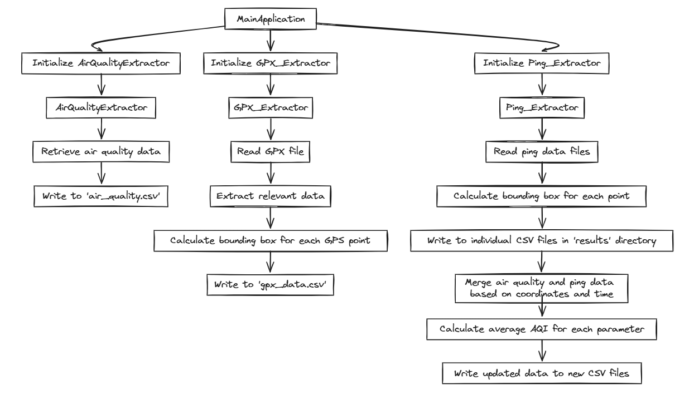
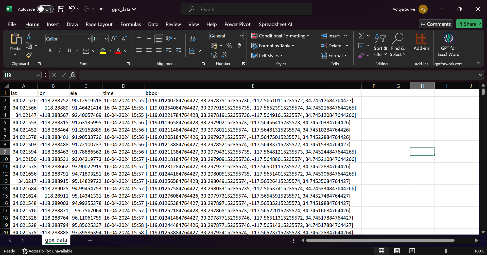
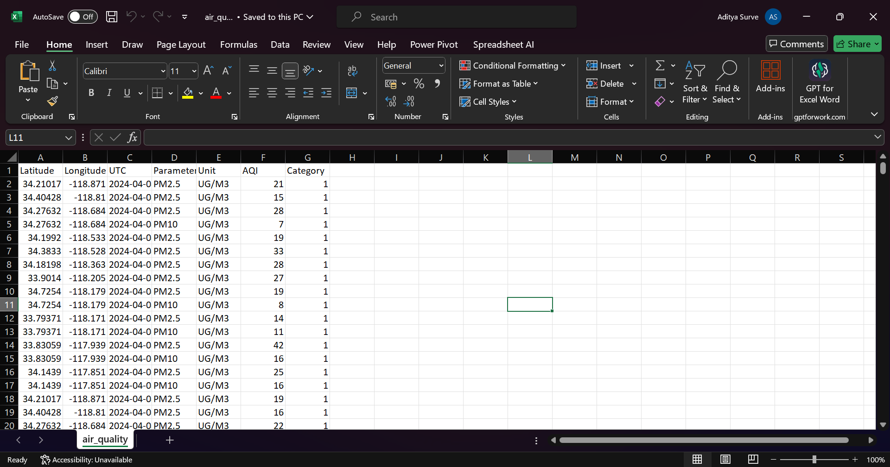
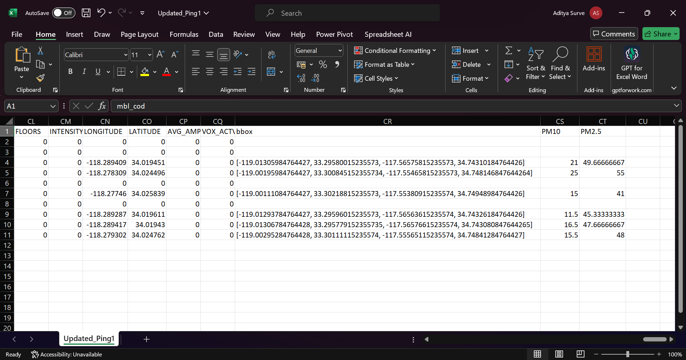
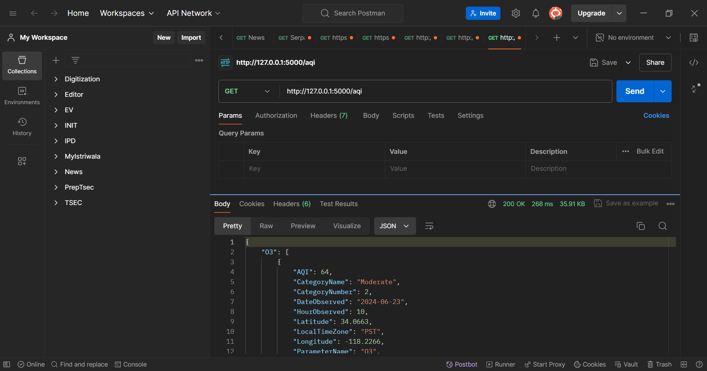
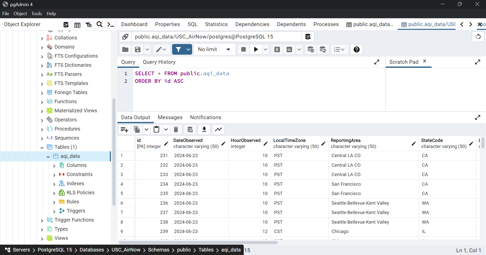
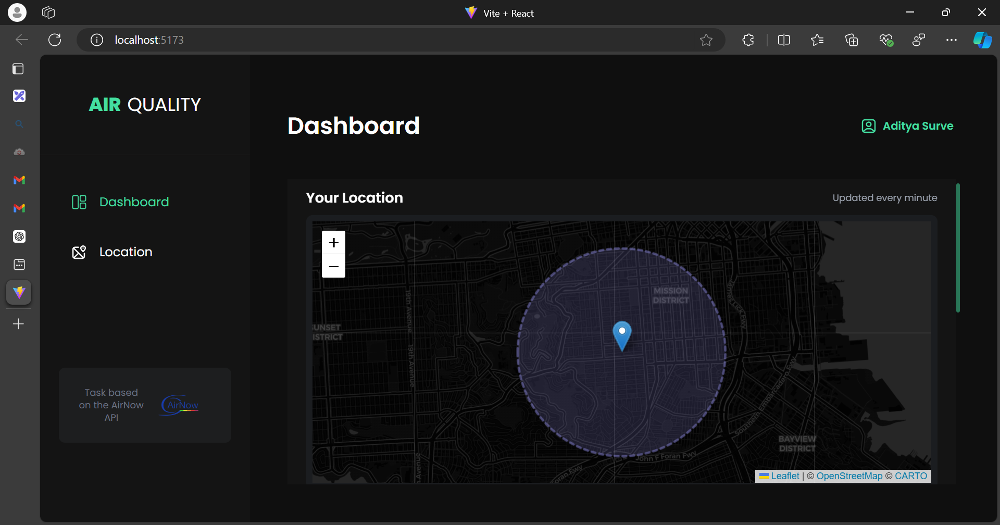
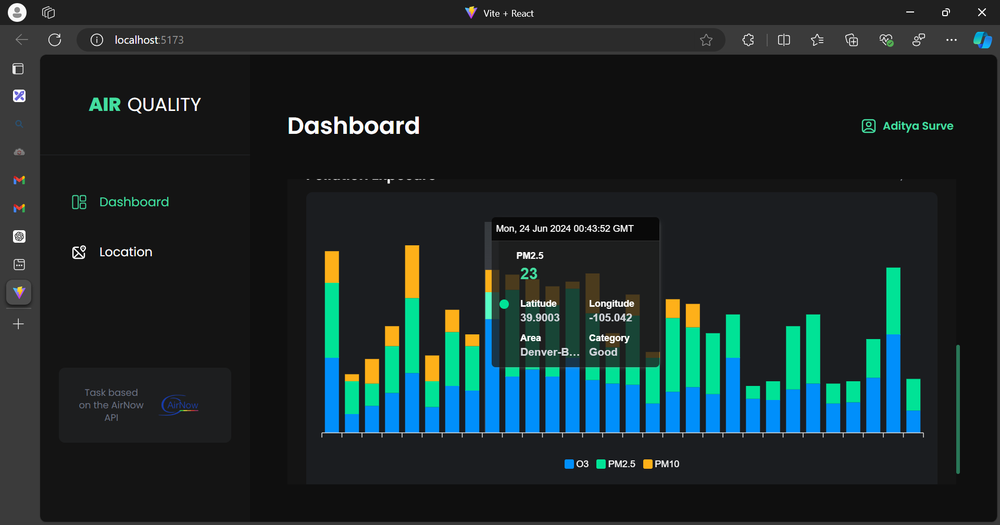
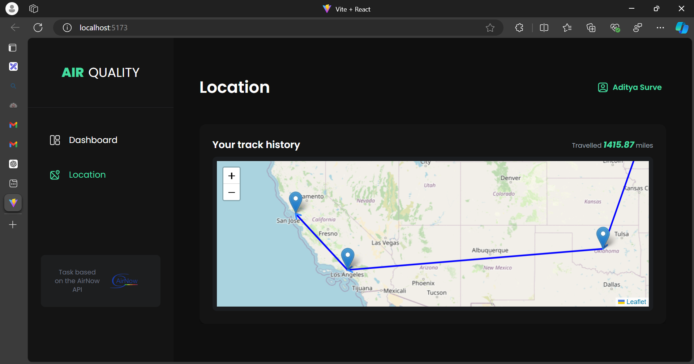

# Project Overview

This project is a comprehensive data extraction and processing system, designed to handle multiple data sources and formats. It consists of several components, each with a specific role in the data processing pipeline.

## MainApplication

This is the core of the system. It orchestrates the entire data extraction and processing workflow. It initializes the necessary objects, including instances of the `AirQualityExtractor`, `GPX_Extractor`, and `Ping_Extractor` classes. It then calls the respective methods of these classes to extract, process, and update the data.

## GPX_Extractor

This component is responsible for handling GPX files. It reads the GPX file and extracts the relevant data, including latitude, longitude, elevation, and timestamp. It also calculates the bounding box for each GPS point based on the provided distance. The extracted GPX data, including the bounding box, is then written to a CSV file named 'gpx_data.csv'.

## AirQualityExtractor

This component interacts with the AirNow API to retrieve air quality data. It uses the bounding box and timestamp information extracted from the GPX files to request the relevant data. The retrieved air quality data is then written to a CSV file named 'air_quality.csv'.

## Ping_Extractor

This component handles the ping data files. It reads the ping data files from the 'SurveyData' directory and stores the data in a dictionary. It also calculates the bounding box for each ping data point based on the provided distance. The bounding box information is then appended to the ping data. The ping data, including the bounding box, is written to individual CSV files in the 'results' directory. This component also merges the air quality data with the ping data, calculates the average AQI for each parameter, and writes the updated data to new CSV files.

Each of these components is designed to work independently, allowing for flexibility and modularity. This design makes it easy to add, remove, or modify components as needed without affecting the overall system.

## Backend - Flask

The backend of the system is built using Flask, a lightweight and flexible Python web framework. It is designed to make API calls every minute to retrieve air quality details based on the user's current latitude and longitude.

## Database - PostgreSQL

The system uses PostgreSQL, an advanced open-source relational database, for data storage and management. It is renowned for its proven architecture, reliability, robustness, and data integrity. The database stores the user's travel history and pollution exposure data, enabling the frontend to fetch and display historical data efficiently.

## Frontend - React

The frontend, developed in React, fetches the data for the previous hour and displays the pollution exposure and the travel history of the user. This real-time data visualization provides users with valuable insights into their environmental exposure.

Each of these components is designed to work independently, allowing for flexibility and modularity. This design makes it easy to add, remove, or modify components as needed without affecting the overall system.